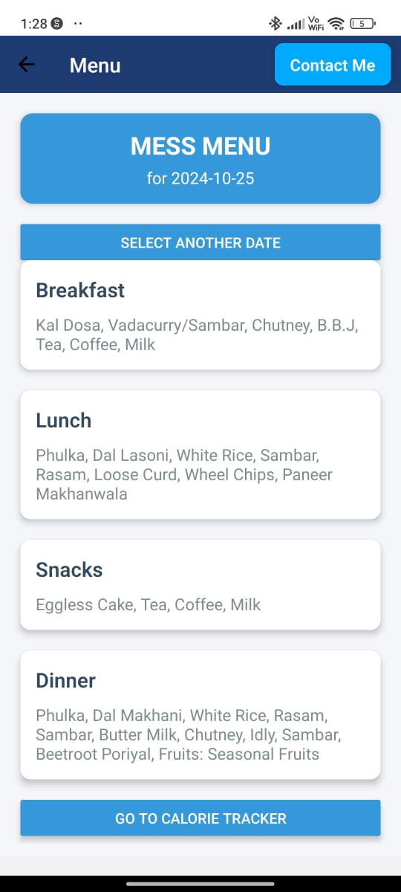
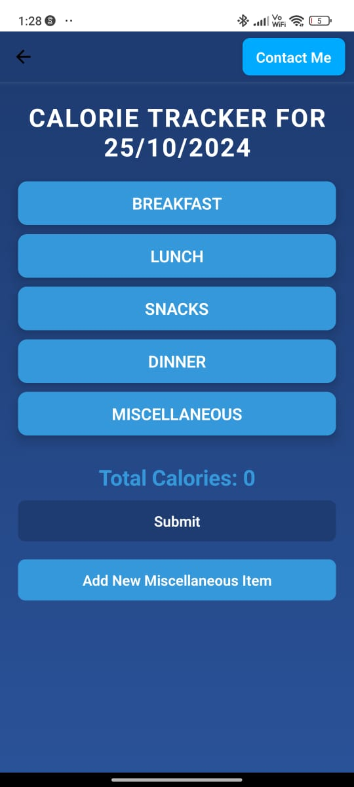
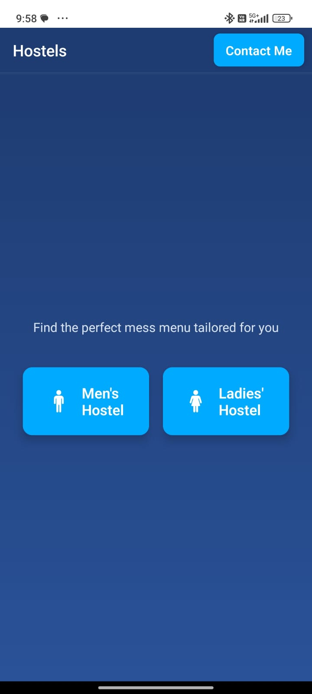

# **BeyondMess - Mess Menu & Calorie Tracking App**

**BeyondMess** is a mobile application designed to streamline hostel meal management and calorie tracking. It allows hostel residents to view their daily mess menu, track calorie intake, and receive push notifications for timely reminders. 

---

## **Features**

- **Mess Menu Display**:  
   - Professionally designed interface to view daily menus (breakfast, lunch, snacks, dinner).  
   - Dynamic menu fetched and displayed seamlessly.

- **Calorie Tracker**:  
   - Track calorie intake for meals and snacks.  
   - Fetch calorie data for missing items via **Groq API**.  
   - Store and manage calorie data locally and sync it to Firebase.

- **Push Notifications**:  
   - Receive reminders for daily menus using **Expo Notifications**.  
   - Notifications managed via device tokens stored in **Firebase Firestore**.

- **Unique User Management**:  
   - Automatically generate unique user IDs for different devices using **UUID**.  
   - Tokens for notifications are managed efficiently.

- **Fitness Tracking**:  
   - Save and retrieve calorie intake history.  
   - Sync calories to a fitness tracker for improved monitoring.

---

## **Technologies Used**

- **Frontend**: React Native, Expo  
- **Backend**: Firebase Firestore  
- **Notifications**: Expo Notifications  
- **Calorie Data Fetching**: Groq API  
- **Local Storage**: AsyncStorage  
- **Unique ID Generation**: UUID  

---

## **Project Setup**

### **1. Clone the Repository**
```bash
git clone https://github.com/yourusername/BeyondMess.git
cd BeyondMess
```

---

### **2. Install Dependencies**
Run the following command to install all required dependencies:
```bash
npm install
```

---

### **3. Configure Firebase**
1. Go to the [Firebase Console](https://console.firebase.google.com/).
2. Create a project and enable Firestore Database.
3. Add your Firebase credentials in a `firebase.js` file:
```javascript
import { initializeApp } from 'firebase/app';
import { getFirestore } from 'firebase/firestore';

const firebaseConfig = {
  apiKey: "YOUR_API_KEY",
  authDomain: "YOUR_AUTH_DOMAIN",
  projectId: "YOUR_PROJECT_ID",
  storageBucket: "YOUR_STORAGE_BUCKET",
  messagingSenderId: "YOUR_MESSAGING_SENDER_ID",
  appId: "YOUR_APP_ID",
};

const app = initializeApp(firebaseConfig);
export const db = getFirestore(app);
```

---

### **4. Run the App**
To start the development server and test the app:
```bash
expo start
```
Scan the QR code using **Expo Go** on a physical device.

---

### **5. Push Notifications Setup**
1. Ensure physical devices are used as **Expo Notifications** do not work in simulators.  
2. Tokens are stored in Firestore under unique user IDs generated via **UUID**.  
3. Run the notification script to send notifications:
```bash
node sendNotifications.js
```

---

## **Screenshots**

### **Mess Menu Display**  
A clean and visually appealing mess menu interface:


---

### **Calorie Tracker**  
Track calories dynamically and fetch missing data:


---

### **Category Selection**  
Choice your mess type and gender:


---

## **Code Structure**

```plaintext
BeyondMess/
├── App.js                   # Main app entry point
├── firebase.js              # Firebase configuration
├── sendNotifications.js     # Push notification script
├── NotificationService.js   # Expo Notifications service
├── assets/                  # Images and icons
├── src/
│   ├── screens/
│   │   ├── HostelSelection.js
│   │   ├── MessSelection.js
│   │   ├── MenuDisplay.js
│   │   ├── CalorieTracker.js
│   │   └── FitnessTrackingScreen.js
│   ├── ContactUsModal.js
│   ├── AddNewItemModal.js
│   └── MealModal.js
├── images/                  # Screenshots for documentation
└── package.json             # Dependencies
```

---

## **Push Notification Workflow**

1. **Device Registration**: Each device generates a **unique Expo Push Token** stored in **Firebase Firestore**.
2. **Backend Script**: Fetches all stored tokens and sends notifications via **Expo Push API**.
3. **Notifications**: Users receive reminders for meal updates.

---

## **Build and Deployment**

### **For Android (APK Build)**
1. Install `eas-cli`:
   ```bash
   npm install -g eas-cli
   ```
2. Build the APK:
   ```bash
   eas build -p android
   ```
3. Download the APK and upload it to Google Play Console.

---

## **Contributing**

Contributions are welcome! If you find any issues or want to add features, please create a pull request.

---

## **License**

This project is licensed under the **MIT License**.

---

## **Contact**

- **Email**: your-email@example.com  
- **GitHub**: [YourUsername](https://github.com/yourusername)

---

> **Note**: Add your project images to the `images/` folder and update the paths in this file to ensure the documentation looks polished! 🚀